# Multimodal Enterprise RAG System - Architecture Diagram

## System Architecture Overview

```mermaid
graph TB
    UI[Streamlit UI<br/>File Upload, Query, Graph Explorer]
    
    subgraph "Ingestion Pipeline"
        subgraph "Multimodal Processors"
            TP[Text Processor<br/>PDF, TXT<br/>LangChain Chunking]
            IP[Image Processor<br/>JPG, PNG<br/>OCR + GPT-4V]
            AP[Audio Processor<br/>MP3, WAV<br/>Whisper API]
        end
        
        subgraph "Extraction & Classification"
            EE[Entity Extractor<br/>GPT-4o Structured Output]
            RE[Relationship Extractor<br/>Entity Relations]
            DC[Domain Classifier<br/>Auto-tagging]
            SG[Schema Generator<br/>Graph Schema Mapping]
        end
    end
    
    subgraph "Storage Layer"
        NEO4J[(Neo4j<br/>Knowledge Graph<br/>Entities, Relationships<br/>Content Nodes)]
        QDRANT[(Qdrant<br/>Vector Database<br/>Embeddings + Metadata)]
    end
    
    subgraph "Query Pipeline"
        subgraph "Standard Pipeline"
            QR[Query Rewriter<br/>Classification & Expansion]
            RA[Retrieval Agent<br/>LangChain Tools]
            AG1[Answer Generation]
        end
        
        subgraph "Agentic Pipeline"
            QVA[Query Validation Agent<br/>Security & Complexity]
            QTA[Query Triage Agent<br/>Strategy Selection]
            ROA[Retrieval Orchestration Agent<br/>Direct Data Access]
            AGA[Answer Generation Agent<br/>Multi-step Reasoning]
            PPA[Post-Processing Agent<br/>Validation & Hallucination]
        end
        
        CREWAI[CrewAI Orchestrator<br/>Optional Multi-Agent Coordination]
    end
    
    subgraph "Search Layer"
        GS[Graph Search<br/>Cypher Queries<br/>Entity Traversal]
        KS[Keyword Search<br/>BM25 Algorithm<br/>Metadata Filtering]
        VS[Vector Search<br/>Cosine Similarity<br/>Semantic Matching]
        HS[Hybrid Search<br/>Reciprocal Rank Fusion<br/>Combines All Methods]
    end
    
    subgraph "Supporting Systems"
        EVAL[Evaluation Framework<br/>DeepEval Metrics<br/>Confident AI]
        TELEM[Telemetry System<br/>LangSmith Integration<br/>Metrics Tracking]
    end
    
    OPENAI[OpenAI API<br/>GPT-4o, GPT-4V<br/>Whisper, Embeddings]
    
    %% Ingestion Flow
    UI -->|Upload Files| TP
    UI -->|Upload Files| IP
    UI -->|Upload Files| AP
    TP -->|Chunks| EE
    IP -->|Captions/OCR| EE
    AP -->|Transcriptions| EE
    EE -->|Entities| RE
    EE -->|Content| DC
    RE -->|Relations| SG
    DC -->|Tags| SG
    SG -->|Store| NEO4J
    SG -->|Store| QDRANT
    
    %% Query Flow - Standard Pipeline
    UI -->|Query| QR
    QR -->|Rewritten Query| RA
    RA -->|Search Request| HS
    HS -->|Query| GS
    HS -->|Query| KS
    HS -->|Query| VS
    GS -->|Results| HS
    KS -->|Results| HS
    VS -->|Results| HS
    HS -->|Retrieved Context| RA
    RA -->|Context| AG1
    AG1 -->|Answer| UI
    
    %% Query Flow - Agentic Pipeline
    UI -->|Query| QVA
    QVA -->|Validated Query| QTA
    QTA -->|Strategy| ROA
    ROA -->|Search Request| HS
    HS -->|Retrieved Context| ROA
    ROA -->|Context| AGA
    AGA -->|Answer| PPA
    PPA -->|Validated Answer| UI
    
    %% CrewAI Orchestration (Optional)
    CREWAI -.->|Orchestrates| QVA
    CREWAI -.->|Orchestrates| QTA
    CREWAI -.->|Orchestrates| ROA
    CREWAI -.->|Orchestrates| AGA
    CREWAI -.->|Orchestrates| PPA
    
    %% Search to Storage
    GS -->|Cypher Query| NEO4J
    VS -->|Vector Query| QDRANT
    KS -->|Metadata Query| QDRANT
    
    %% LLM Services
    TP -.->|Text Processing| OPENAI
    IP -.->|Image Processing| OPENAI
    AP -.->|Audio Processing| OPENAI
    EE -.->|Entity Extraction| OPENAI
    RE -.->|Relationship Extraction| OPENAI
    DC -.->|Classification| OPENAI
    AG1 -.->|Answer Generation| OPENAI
    AGA -.->|Answer Generation| OPENAI
    VS -.->|Embeddings| OPENAI
    
    %% Supporting Systems
    EVAL -.->|Test Queries| UI
    EVAL -.->|Metrics| TELEM
    TELEM -.->|Tracing| QVA
    TELEM -.->|Tracing| QTA
    TELEM -.->|Tracing| ROA
    TELEM -.->|Tracing| AGA
    TELEM -.->|Tracing| PPA
    
    %% Styling
    classDef storage fill:#e1f5ff,stroke:#01579b,stroke-width:2px
    classDef processing fill:#f3e5f5,stroke:#4a148c,stroke-width:2px
    classDef search fill:#e8f5e9,stroke:#1b5e20,stroke-width:2px
    classDef agent fill:#fff9c4,stroke:#f57f17,stroke-width:2px
    classDef llm fill:#fff3e0,stroke:#e65100,stroke-width:2px
    classDef ui fill:#fce4ec,stroke:#880e4f,stroke-width:2px
    classDef support fill:#f1f8e9,stroke:#33691e,stroke-width:2px
    
    class NEO4J,QDRANT storage
    class TP,IP,AP,EE,RE,DC,SG processing
    class GS,KS,VS,HS search
    class QR,RA,AG1,QVA,QTA,ROA,AGA,PPA,CREWAI agent
    class OPENAI llm
    class UI ui
    class EVAL,TELEM support
```

## Component Details

### 1. Data Ingestion Pipeline
- **Text Processor**: Handles PDF and TXT files, uses LangChain's RecursiveCharacterTextSplitter for intelligent chunking
- **Image Processor**: OCR (Tesseract) + GPT-4 Vision for captioning and text extraction
- **Audio Processor**: OpenAI Whisper API for transcription

### 2. Processing & Extraction
- **Entity Extractor**: GPT-4 with structured output to extract entities (Person, Organization, Location, Concept, Date)
- **Relationship Extractor**: Identifies relationships between entities
- **Domain Classifier**: GPT-4 classifies content into domains (finance, legal, technical, medical, etc.)
- **Schema Generator**: Dynamically generates graph schema based on extracted entities

### 3. Storage Layer
- **Neo4j**: Knowledge graph storing entities, relationships, and content nodes with domain tags
- **Qdrant**: Vector database storing chunk embeddings with rich metadata (modality, domain tags, file info)

### 4. Search Layer
- **Keyword Search**: BM25-based keyword matching with metadata filtering
- **Vector Search**: Semantic similarity search using OpenAI embeddings
- **Graph Search**: Cypher queries for entity traversal and relationship discovery
- **Hybrid Search**: Combines all three methods using Reciprocal Rank Fusion (RRF)

### 5. Agentic Query Pipeline (New)
- **Query Validation Agent**: Validates queries with security checks, assesses complexity, and detects intent
- **Query Triage Agent**: Classifies queries and selects optimal search strategy
- **Retrieval Orchestration Agent**: LangChain agent with direct data store access tools (graph, keyword, vector, hybrid)
- **Answer Generation Agent**: Generates answers with multi-step reasoning support
- **Post-Processing Agent**: Validates answers, detects hallucinations, verifies citations, and calculates confidence
- **Agentic Query Pipeline**: Orchestrates all agents with iterative refinement
- **CrewAI Orchestrator** (Optional): Uses CrewAI framework for multi-agent orchestration with role-based agents and task management

### 6. Standard Query Pipeline (Legacy)
- **Query Rewriter**: Classifies query type and expands queries with synonyms
- **Retrieval Agent**: LangChain agent that orchestrates search tools dynamically
- **Query Pipeline**: End-to-end flow from validation → retrieval → generation → post-processing

### 7. LLM Services
- **OpenAI API**: 
  - GPT-4o for text generation and structured extraction
  - GPT-4 Vision for image understanding
  - Whisper for audio transcription
  - text-embedding-3-small for vector embeddings

### 8. Evaluation Framework
- **Test Suite**: DeepEval-based evaluation with test cases from SQuAD v2 (DocVQA and FLEURS support available)
- **DeepEval Metrics**: Generator metrics (Hallucination, Answer Relevancy, Faithfulness)
- **Confident AI**: Automatic upload of evaluation results for hosted reports and dashboards
- **Caching**: DeepEval results are cached to avoid redundant API calls

### 9. Observability & Telemetry
- **Telemetry System**: Tracks agent operations, timing, success/error rates, and metadata
- **LangSmith Integration**: LangChain tracing and monitoring for agent operations
- **Metrics Collection**: Structured logging with operation-level metrics
- **Export Capabilities**: Telemetry data can be exported for analysis

## Data Flow

### Ingestion Flow
1. User uploads files (PDF, TXT, JPG, PNG, MP3) via Streamlit UI
2. Multimodal Processors extract content from text, images, and audio
3. Entity Extraction & Classification extracts entities, relationships, and domain tags
4. Data is stored in Neo4j (knowledge graph) and Qdrant (vector database)

### Query Flow
1. User submits query via Streamlit UI
2. Query Pipeline (Standard or Agentic with CrewAI) processes the query
3. Hybrid Search retrieves from Neo4j and Qdrant using:
   - Graph Search: Entity traversal and relationships
   - Keyword Search: BM25 exact matching
   - Vector Search: Semantic similarity
   - RRF: Combines all methods for optimal results
4. Retrieved context is passed to OpenAI for answer generation
5. Response with citations and confidence scores is returned to UI

## Technology Stack

- **UI**: Streamlit
- **LLM**: OpenAI (GPT-4o, GPT-4 Vision, Whisper)
- **Graph DB**: Neo4j 5.15.0
- **Vector DB**: Qdrant v1.7.0
- **Orchestration**: LangChain 1.0
- **Evaluation**: DeepEval
- **Deployment**: Docker Compose (local development)

## Key Features

- ✅ Multimodal ingestion (text, image, audio)
- ✅ Intelligent chunking with LangChain
- ✅ LLM-based entity and relationship extraction
- ✅ Automatic domain classification
- ✅ Hybrid search (keyword + vector + graph)
- ✅ Agent-based retrieval orchestration
- ✅ **Agentic query pipeline with 5-stage orchestration**
- ✅ **CrewAI multi-agent framework support (optional)**
- ✅ **Intelligent tool selection and direct data store access**
- ✅ **Multi-step reasoning and answer validation**
- ✅ **Interactive graph explorer with pyvis visualization**
- ✅ **Telemetry and observability system**
- ✅ Comprehensive error handling
- ✅ Evaluation-first approach with DeepEval
- ✅ **Confident AI integration for evaluation reports**

## Architecture Decisions

This section explains the key architectural decisions made in designing this system.

### 1. Agentic Pipeline vs Simple Pipeline

**Decision**: Implement both agentic and standard query pipelines, with agentic as the primary approach.

**Rationale**:
- **Agentic Pipeline**: Provides sophisticated query understanding, multi-step reasoning, and intelligent tool selection. Each stage (validation, triage, retrieval, generation, post-processing) is handled by specialized agents that can reason about the task.
- **Standard Pipeline**: Maintained for backward compatibility and simpler use cases where the full agentic overhead isn't needed.
- **Trade-off**: Agentic pipeline has higher latency but provides better accuracy and reasoning capabilities. Standard pipeline is faster but less sophisticated.

### 2. CrewAI for Multi-Agent Orchestration

**Decision**: Use CrewAI framework as an optional orchestration layer over the agentic pipeline.

**Rationale**:
- **Role-based Agents**: CrewAI provides a structured way to define agent roles, goals, and backstories, making the system more maintainable.
- **Task Management**: Built-in task sequencing and dependency management reduces boilerplate code.
- **Optional Integration**: CrewAI is optional - the system can run with direct agent calls or with CrewAI orchestration, providing flexibility.
- **Hybrid Approach**: Agents can use both LangChain tools and CrewAI's task system, leveraging the best of both frameworks.

### 3. Hybrid Search (RRF) vs Single Method

**Decision**: Implement hybrid search using Reciprocal Rank Fusion (RRF) to combine keyword, vector, and graph search.

**Rationale**:
- **Complementary Strengths**: 
  - Keyword search (BM25) excels at exact term matching
  - Vector search captures semantic similarity
  - Graph search discovers relationships and entity connections
- **RRF Benefits**: Combines results from all three methods, giving each method equal weight initially, then reranking based on reciprocal rank positions.
- **Flexibility**: The retrieval orchestration agent can choose to use all methods or selectively use specific methods based on query type.
- **Better Coverage**: Hybrid approach ensures we don't miss relevant results that might only be found by one method.

### 4. Neo4j + Qdrant Dual Storage

**Decision**: Use both Neo4j (graph database) and Qdrant (vector database) for different purposes.

**Rationale**:
- **Neo4j for Structure**: Stores entities, relationships, and content nodes. Enables graph traversal, relationship discovery, and structured queries. Perfect for "who knows whom" or "what relates to what" queries.
- **Qdrant for Semantics**: Stores chunk embeddings with metadata. Enables semantic similarity search and fast retrieval of relevant content. Perfect for "find similar content" queries.
- **Complementary**: Graph structure helps with entity relationships, while vector search helps with semantic content matching. Together they provide comprehensive retrieval capabilities.
- **Separation of Concerns**: Each database is optimized for its specific use case, rather than trying to force one database to do everything.

### 5. Evaluation-First Approach

**Decision**: Build the evaluation framework alongside the system, not as an afterthought.

**Rationale**:
- **Quality Assurance**: Continuous evaluation ensures the system maintains quality as it evolves.
- **DeepEval Integration**: Uses industry-standard metrics (Hallucination, Answer Relevancy, Faithfulness) rather than custom metrics that may not be validated.
- **Confident AI Integration**: Automatic upload of results to Confident AI provides hosted dashboards and historical tracking.
- **Test-Driven Development**: Evaluation framework helps identify regressions and improvements systematically.
- **Cost Management**: Caching evaluation results reduces redundant API calls during development and testing.

### 6. Telemetry and Observability

**Decision**: Implement comprehensive telemetry system with LangSmith integration.

**Rationale**:
- **Visibility**: Track agent operations, timing, success rates, and errors to understand system behavior.
- **Debugging**: Detailed metrics help identify bottlenecks and failure points.
- **Performance Monitoring**: Track latency, throughput, and resource usage.
- **LangSmith Integration**: Leverages LangChain's native tracing for agent operations, providing detailed execution traces.
- **Export Capabilities**: Telemetry data can be exported for custom analysis and reporting.
- **Production Readiness**: Observability is critical for production deployments to monitor system health.

### 7. Multi-Step Reasoning in Answer Generation

**Decision**: Implement multi-step reasoning capability in the answer generation agent.

**Rationale**:
- **Complex Queries**: Some queries require breaking down into steps (e.g., "How did X relate to Y?" requires understanding both X and Y first).
- **Transparency**: Reasoning steps are displayed to users, making the answer generation process transparent and explainable.
- **Quality**: Multi-step reasoning often produces more accurate and comprehensive answers for complex questions.
- **Parsing Improvements**: Enhanced parsing logic captures full reasoning steps including multi-line content, ensuring complete reasoning is preserved.

### 8. Graph Explorer UI Component

**Decision**: Build interactive graph visualization using pyvis instead of just text-based results.

**Rationale**:
- **User Experience**: Visual graph exploration is more intuitive than reading text-based results.
- **Neo4j-like Experience**: Provides similar functionality to Neo4j browser, making it familiar to users.
- **Interactive**: Users can drag nodes, zoom, pan, and explore relationships visually.
- **Multiple View Modes**: Supports entity search, full graph view, and subgraph exploration for different use cases.
- **Professional Presentation**: Visual graphs are more engaging and help users understand the knowledge structure better.

